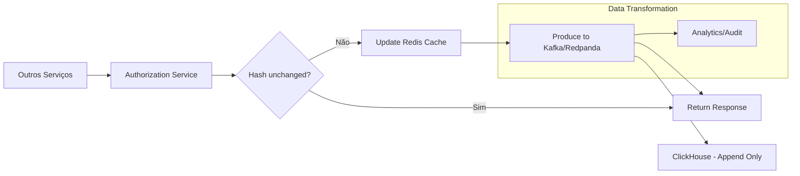
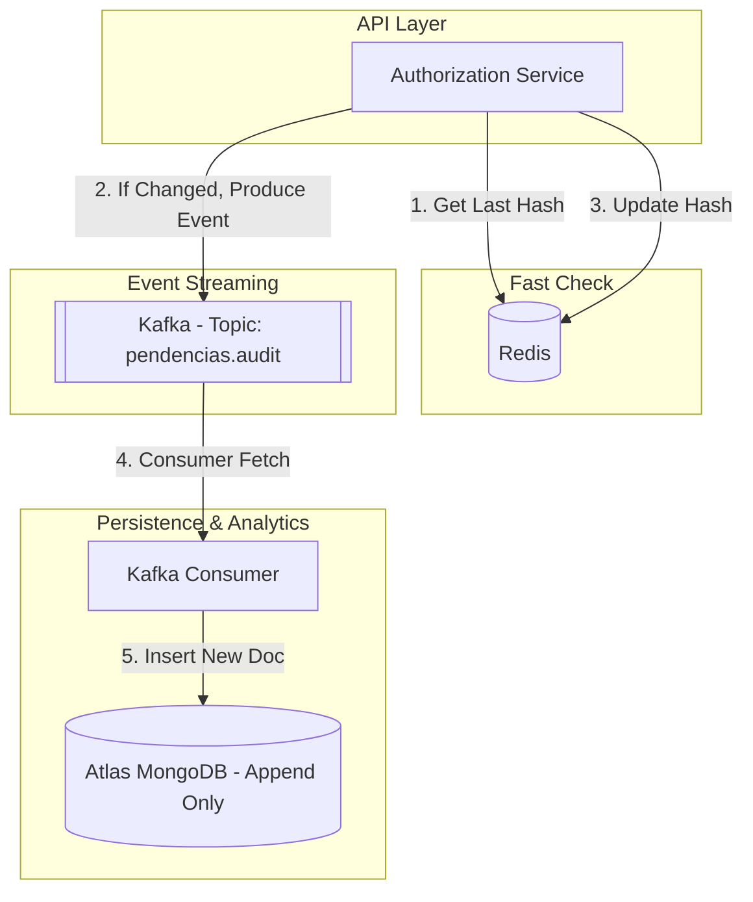
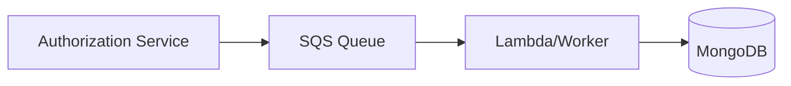
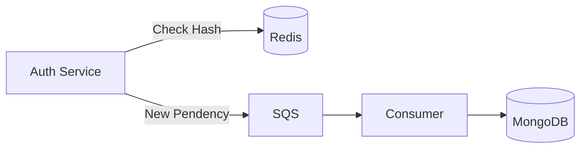
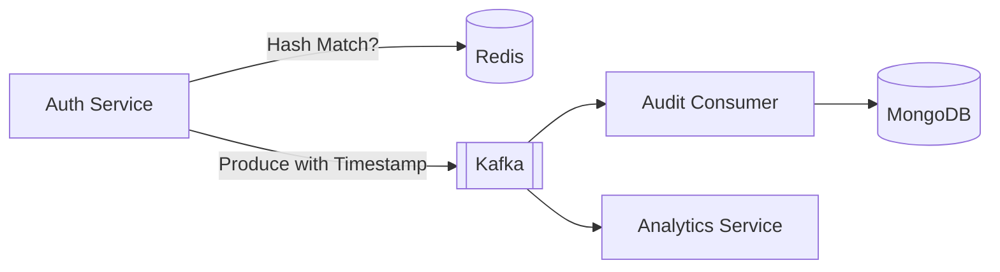

Olá! Sou o **C6-Gestor-de-Pendências**. Entendi perfeitamente o desafio: equilibrar a performance crítica de um serviço financeiro com a necessidade de auditoria detalhada e análise de dados em larga escala.

Para atender aos requisitos de baixa latência (incremento mínimo sobre os 25ms atuais) e garantir a ordem e integridade, utilizaremos um padrão de **Event Sourcing** simplificado com **Deduplicação via Hash**.

Aqui estão as propostas:

---

## 1. Solução Ideal (Tecnologia Livre)

Nesta arquitetura, priorizamos a mínima latência no *hot path* e o máximo de eficiência analítica.

### Lógica de Funcionamento

1. **Hash & Diff:** O serviço `authorization` calcula um **SHA-256** do JSON de pendências.
2. **Cache de Estado:** Consulta o **Redis** (usando o `customer_id` como chave) para verificar se o hash mudou.
3. **Processamento Assíncrono:** Se o hash for diferente, o serviço dispara o evento para um **Stream de Dados** e atualiza o Redis.
4. **Persistência Analítica:** Utilizamos o **ClickHouse** como destino final por sua performance excepcional em *append-only* e compressão de dados para volumes massivos.

### Diagrama HLD (Ideal)

---

## 2. Solução com Sistemas Homologados

Utilizando estritamente o stack: **Redis, Atlas MongoDB, Kafka, SQS, SNS.**

### Componentes da Solução

* **Deduplicação (Redis):** O Redis armazenará o último hash gerado para aquele cliente com um TTL adequado. Isso evita gravações redundantes.
* **Mensageria (Kafka):** Utilizado para garantir a **ordem das mensagens** (via partition key baseada no `customer_id`) e alta vazão.
* **Persistência (MongoDB Atlas):** Ideal para o schema flexível das pendências. As mensagens serão inseridas como novos documentos (Append-only).
* **Timestamp:** Cada mensagem receberá um campo `processed_at` no padrão ISO-8601 antes de entrar no Kafka.

### Diagrama HLD (Homologado)

---

## 3. Arquitetura Evolutiva

Dividir a implementação em etapas permite entregar valor rápido e validar a performance.

### Passo 1: O MVP (Sincronismo com SQS)

Nesta fase, focamos apenas na persistência. O serviço envia a pendência para o **SQS** de forma simples.

* **Vantagem:** Baixo custo de implementação.
* **Limitação:** Não há checagem de hash (grava tudo) e a ordem pode ser um desafio se não usar filas FIFO.

### Passo 2: Otimização de Custo e Volume (Hash Check)

Introduzimos o **Redis** para realizar o *hash check*.

* **Explicação:** O serviço só envia para o SQS se as pendências mudaram de fato. Adicionamos o **Timestamp** na aplicação antes do envio. Isso reduz drasticamente o volume de escrita no banco e o tráfego de rede.

### Passo 3: Escala e Ordem Total (Kafka)

Substituímos o SQS pelo **Kafka** para suportar volumes massivos e garantir que a transição das pendências seja lida na ordem exata por sistemas analíticos.

* **Explicação:** O Kafka permite que múltiplos consumidores (Auditoria, Antifraude, Analytics) leiam o mesmo stream de alterações sem impactar o serviço principal. A arquitetura torna-se puramente orientada a eventos.

Qual dessas abordagens melhor se adapta à infraestrutura atual do seu squad?
